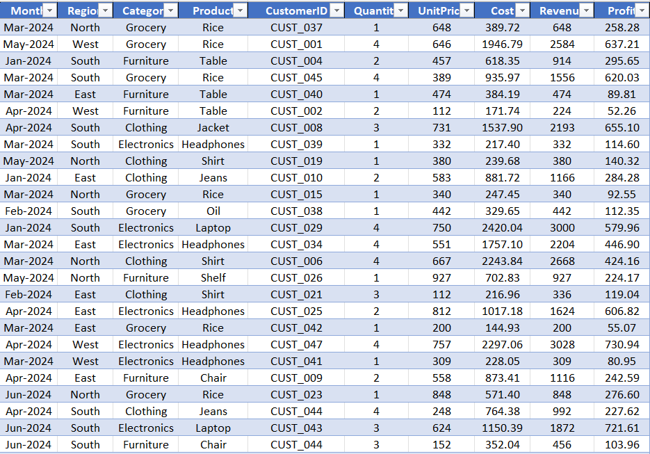
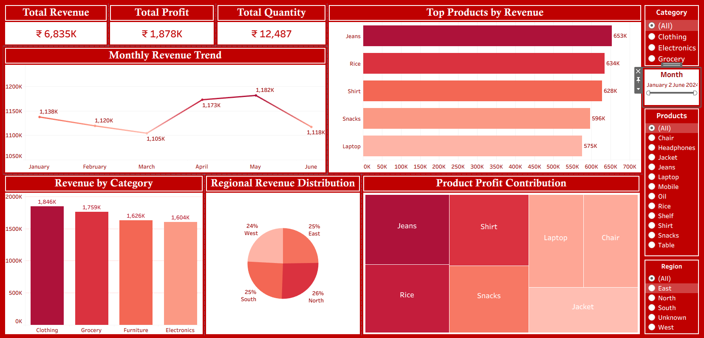

# Sales Performance Analysis – Tableau Dashboard

## Project Overview

The **Sales Performance Analysis** project presents an interactive Tableau dashboard designed to analyze business sales performance across multiple dimensions including products, categories, regions, and time.

The dashboard provides insights into revenue trends, product performance, and regional sales distribution. By transforming raw sales data into meaningful visual insights, the project demonstrates how data visualization tools can help businesses make informed and data-driven decisions.

This project highlights the ability to analyze transactional data and present it through clear, interactive dashboards.

---

## Executive Summary

This project analyzes retail sales performance to evaluate not just revenue growth, but the quality of that revenue in terms of profitability and sustainability.

The analysis reveals that while certain products and categories (such as Clothing) drive high revenue, profitability is uneven across products and regions. A small set of products contributes disproportionately to both revenue and profit, indicating a concentration risk in product performance.

Additionally, regional differences suggest that sales volume does not always translate into profit efficiency, highlighting potential gaps in pricing, cost management, or product mix.

The dashboard enables business stakeholders to identify:

- Revenue vs profit imbalances across products
- High-performing yet potentially over-relied product segments
- Regional performance gaps in revenue efficiency
- Time-based sales patterns for better planning

Overall, the analysis shifts focus from “how much we sell” to “how well we earn”, enabling more sustainable and profit-driven decision-making.

---

# Business Context

Businesses generate large amounts of transactional sales data every day. However, raw data alone does not provide meaningful insights unless it is properly analyzed and visualized.

Organizations need analytical dashboards to:

- Monitor overall sales performance
- Identify high-performing products
- Track revenue growth trends
- Understand regional sales distribution
- Evaluate product profitability

Data visualization tools such as Tableau help convert raw business data into actionable insights that support strategic decision-making.

---

# Business Objective

The objective of this project is to build an interactive Tableau dashboard that helps analyze and monitor sales performance.

The dashboard focuses on answering key business questions related to:

- Monthly sales trends
- Product revenue performance
- Category-wise revenue contribution
- Regional distribution of sales
- Product profitability

---

# Dataset Preview



---

# Dataset Information

The dataset used in this project contains **4,997 sales transaction records across 10 fields**, including product information, regional sales distribution, and financial metrics.

### Dataset Columns

| Column     | Description                             |
| ---------- | --------------------------------------- |
| Month      | Month of the sales transaction          |
| Region     | Sales region (North, South, East, West) |
| Category   | Product category                        |
| Product    | Name of the product                     |
| CustomerID | Unique customer identifier              |
| Quantity   | Number of units sold                    |
| UnitPrice  | Price per product unit                  |
| Cost       | Cost associated with the product        |
| Revenue    | Total sales revenue generated           |
| Profit     | Profit generated from the transaction   |

The dataset allows analysis across multiple business dimensions including time, product category, and geographic regions.

---

## Data Cleaning

Before performing the analysis, the dataset was cleaned to ensure accuracy and consistency.

The following data preparation steps were performed:

- Replaced blank or missing categorical values with **"Unknown"** to maintain data consistency.
- Verified that all **4,997 records across 10 columns** contain valid values after cleaning.
- Ensured numerical fields such as **Quantity, UnitPrice, Cost, Revenue, and Profit** were correctly formatted for analysis.
- Checked for duplicate records and inconsistencies in product and regional data.
- Confirmed that calculated metrics such as **Revenue and Profit** align with the underlying cost and pricing data.

These steps ensured the dataset was reliable for performing accurate **sales performance analysis and dashboard visualization**.

---

# Dashboard Preview



### Interactive Dashboard

Tableau Public Dashboard Link:
https://public.tableau.com/app/profile/sarvesh.vernekar/viz/RetailProject_17662561049580/SalesPerformanceAnalysisDashboard?publish=yes

---

# Dashboard Features

### KPI Summary

The dashboard highlights key business performance indicators including:

- **Total Revenue**
- **Total Profit**
- **Total Quantity Sold**

These KPIs provide a quick overview of the overall business performance.

---

### Monthly Revenue Trend

A line chart visualizes revenue trends across months, helping identify seasonal patterns and fluctuations in sales performance.

---

### Top Products by Revenue

A horizontal bar chart highlights the products generating the highest revenue, allowing businesses to identify their best-performing products.

---

### Revenue by Category

This visualization compares revenue contributions across different categories such as Clothing, Grocery, Furniture, and Electronics.

---

### Regional Revenue Distribution

A pie chart shows how revenue is distributed across different regions, helping businesses understand geographic sales performance.

---

### Product Profit Contribution

A treemap highlights products generating the highest profits, allowing identification of the most profitable product lines.

---

### Interactive Filters

The dashboard includes interactive filters that allow users to dynamically explore the data:

- **Category Filter** – Analyze sales by product category
- **Month Filter** – Explore sales trends across time
- **Product Filter** – View performance of specific products
- **Region Filter** – Analyze sales across geographic regions

These filters allow users to drill down into the data and perform deeper analysis.

---

# Business Problems Addressed

The dashboard helps answer several important business questions:

- Which product generate the highest revenue?
- Which category contribute the most to total sales?
- How does revenue change across different months?
- Which region generate the highest sales revenue?
- Which products generate the highest profit?

Answering these questions helps businesses optimize product strategy and improve overall sales performance.

---

# Key Performance Indicators (KPIs)

The dashboard tracks several important metrics:

- **Total Revenue:** ₹6,835K
- **Total Profit:** ₹1,878K
- **Total Quantity Sold:** 12,487 units

These metrics summarize the overall performance of the business.

---

# Key Insights

From the dashboard analysis, several insights can be identified:

- **Jeans** generate high revenue, making them core drivers of business performance.
- The **Clothing** category dominates revenue, indicating strong demand concentration, but also potential over-dependence on a single category.
- Revenue peaks around **April–May** indicate seasonal demand patterns, which can be leveraged for inventory and marketing planning.
- The **North** region leads in revenue contribution, but without profit comparison, it may not be the most efficient region in terms of margins.
- Certain products like **Jeans,Rice and Shirt** are amoung the top 3 products that contribute significantly higher profits compared to others.

These insights help identify key revenue drivers within the business.

---

# Business Recommendations

Based on the insights obtained from the analysis, the following recommendations can be made:

- Prioritize high-performing products Jeans and Rice by optimizing inventory and ensuring consistent availability.
- Reduce dependency on a single category (Clothing) by strengthening underperforming categories.
- Use seasonal trends (April–May peak) to plan targeted marketing campaigns and inventory allocation.
- Conduct region-wise profit analysis to identify high-revenue but low-efficiency regions.
- Focus on expanding high-margin products rather than only increasing sales volume.

---

## Conclusion

The analysis highlights that business performance is currently driven by a limited set of high-performing products and categories, creating both opportunity and risk.

While revenue growth is strong, it is concentrated, making the business vulnerable to changes in demand for key products. Additionally, differences in regional performance suggest that sales efficiency varies across markets.

This indicates that the business must move beyond simply tracking sales and begin focusing on:

- Profit contribution by product
- Revenue concentration risks
- Regional performance efficiency

A shift toward profit-focused and diversified growth strategies will be critical for long-term sustainability.

---

## Strategic Takeaway

The business is currently revenue-driven but concentrated, with performance heavily dependent on a limited set of products and a dominant category.

To achieve sustainable growth, the focus should shift toward:

- Diversifying revenue sources
- Strengthening underperforming categories
- Improving profit contribution across regions

---

## Business Impact

If implemented, these recommendations can:

- Improve profit margins by optimizing discount strategies
- Increase revenue efficiency by focusing on high-value segments
- Reduce losses from underperforming products
- Enable data-driven regional expansion decisions

---

## Risk & Limitation

- The dataset does not include discount or customer behavior data, limiting deeper profitability and retention analysis.
- Profitability insights are based on available cost and revenue fields, and may not capture external factors such as logistics or marketing costs.

---

## Next Steps / Future Analysis

1. Customer Profitability Analysis
- Identify high-revenue but low-profit customers
- Segment customers based on profitability, not just sales

2. Discount Optimization Model
- Analyze optimal discount thresholds
- Find the point where discounts stop driving profit

3. Regional Strategy Deep Dive
- Analyze why certain regions perform better in profit vs sales
- Adjust pricing, logistics, or targeting strategies

4. Product Portfolio Rationalization
- Identify loss-making products/sub-categories
- Recommend discontinuation or price correction

---

# Tools Used

- **Tableau Public** – Data visualization and dashboard development
- **Microsoft Excel** – Dataset storage and preparation

---

# Skills Demonstrated

This project demonstrates several core data analytics skills including:

- Data Cleaning
- Data Visualization
- Dashboard Design
- Business Data Analysis
- KPI Development
- Trend Analysis
- Interactive Dashboard Development
- Data Storytelling

---

# Project Structure

```
Sales-Performance-Analysis-Tableau
│
├── dataset
│   └── sales_performance_dataset.xlsx
│
├── dashboard
│   └── sales_performance_dashboard.twbx
│
├── images
│   ├── dataset_preview.png
│   └── sales_dashboard_preview.png
│
└── README.md
```

---

# Repository Structure

README.md – Documentation containing the project overview, business context, objectives, dashboard explanations, key insights, and business recommendations.

sales_performance_dataset.xlsx – Cleaned dataset containing 4,997 sales transaction records across 10 fields, used for analysis and visualization in the dashboard.

sales_performance_dashboard.twbx – Tableau packaged workbook containing the interactive Sales Performance Analysis dashboard and all associated visualizations.

dataset_preview.png – Screenshot preview of the dataset used for the analysis.

sales_dashboard_preview.png – Screenshot of the interactive Sales Performance Analysis Dashboard showcasing KPIs, revenue trends, product performance, and regional distribution.

---

# How to Use

1. Download or clone this repository.
2. Open the Tableau workbook file (`sales_performance_dashboard.twbx`).
3. Explore the interactive dashboard.
4. Use the filters to analyze sales performance by product, category, region, and month.

---

# Author

**Sarvesh Vernekar**

Aspiring Data Analyst passionate about data analytics, visualization, and transforming business data into meaningful insights.

